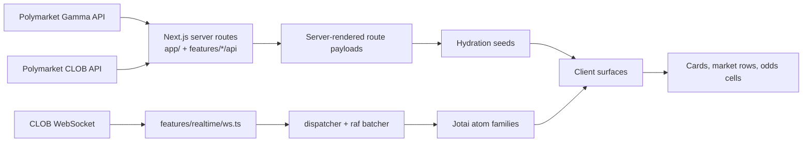
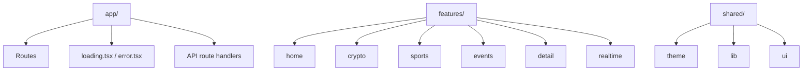

# Polymarket Clone

A high-fidelity Polymarket frontend clone built with `Next.js 16`, `React 19`, `TypeScript`, and `Jotai`.

The goal of this project is to reproduce the feel of the real Polymarket product as closely as possible: route structure, shell chrome, density, card treatment, live prices, loading behavior, and engineering quality.

## general spec

priorities: 

1. UI/UX fidelity to Polymarket
2. Realtime price updates
3. Clean, performant state management

including :
- Polymarket-style home feed with a hero, topic chips, and mixed market cards
- Dedicated `Crypto` surface with client-local filtering and bounded catalog rendering
- Dedicated `Sports Live` and `Sports Futures` surfaces, plus league-specific sports routes
- Dynamic event detail route backed by live Gamma data
- Realtime CLOB WebSocket hydration using token-level Jotai atoms
- Loading states, route contracts, and a substantial test suite

## What’s Shipped

### Product surfaces

- `/` — Polymarket-style home page with hero spotlight, chip-driven feed switching, and mixed market cards
- `/crypto` — crypto-specific surface with family, time, and asset filters
- `/sports/live` — live sports dashboard surface
- `/sports/futures` — futures overview surface
- `/sports/futures/[league]` — league futures dashboards
- `/sports/[league]/games` — league game-market views
- `/sports/[league]/props` — league props-market views
- `/event/[slug]` — event detail page with market rows and realtime hydration

### Data and realtime

- Live event and market data from Polymarket Gamma REST endpoints
- Live price updates from the public Polymarket CLOB WebSocket
- Support for both array-wrapped `book` messages and object `price_change` messages
- Token-level hydration seeds generated server-side and mounted client-side
- Batched update dispatch to avoid broad rerenders on rapid market activity

### UX and implementation details

- Shared Polymarket-cloned shell with sticky header, market nav, footer, and mobile controls
- Dark/light theme support with bootstrap script to avoid theme flicker on first paint
- Server-first route composition with targeted client interactivity where it pays off
- Thin internal API routes for client-side pagination/filter expansion
- Event-route not-found protection via request proxy middleware
- Modular feature organization instead of page-level sprawl

## Architecture

The codebase is organized around product domains:

```text
app/                   Next.js App Router routes and route-level loading/error states
features/home/         Home hero, card feed, chip rail, selectors, client feed expansion
features/crypto/       Crypto parsing, facets, server payload assembly, surface components
features/sports/       Live, futures, games, props, and league-specific sports surfaces
features/events/       Gamma parsing, event-card modeling, shared event feeds
features/detail/       Event header and market-list detail UI
features/realtime/     WebSocket client, dispatcher, raf batching, Jotai atoms, hydration
shared/                Formatting, theme, UI primitives, tag utilities
```

### Data Flow



### Project Structure



A few architecture choices worth calling out:

- `Next.js App Router` is used in a server-first way for initial data fetches and route composition.
- `Jotai` stores live prices at the token level via atom families, which keeps updates local to the smallest UI leaves possible.
- `unstable_cache` and route-level `revalidate` windows are used to balance freshness and page responsiveness.
- The app fetches from live Polymarket APIs directly, then normalizes payload quirks in parser modules instead of leaking raw API shapes through the UI.
- CSS Modules are used throughout to keep styling local, predictable, and easy to audit.

## Realtime Strategy

Realtime behavior is a first-class part of the assignment.

- Initial route renders are seeded from REST data.
- Relevant token IDs are extracted into hydration seeds on the server.
- A shared WebSocket client subscribes to those token IDs on the client.
- Incoming CLOB messages are normalized and pushed through a requestAnimationFrame batcher.
- Jotai atom families update only the affected token state, which reduces broad rerenders during bursts of price activity.

This keeps the app responsive while still feeling live in the places a grader will notice immediately: cards, market rows, odds cells, and sports price surfaces.

## Quality Bar

This repo already goes beyond a “one-weekend assignment” baseline:

- `262` source files under `app/`, `features/`, and `shared/`
- `48` passing test files
- `188` passing tests
- Green production build on `Next.js 16.2.4`

Verified locally on `2026-04-21`:

- `pnpm exec vitest run`
- `pnpm build`
- `pnpm lint`

## Running Locally

```bash
pnpm install
pnpm dev
```

Open [http://localhost:3000](http://localhost:3000).

Production-like run:

```bash
pnpm build
pnpm start
```

## Scripts

```bash
pnpm dev                 # local development
pnpm build               # production build
pnpm start               # run the production build
pnpm lint                # eslint
pnpm exec vitest run     # one-shot test run
```

## External Dependencies

This app currently relies on public Polymarket endpoints and does not require local secrets:

- Gamma API for event and market payloads
- CLOB API for market history
- CLOB WebSocket for live market updates

Because this is a clone project, the project intentionally focuses on read-only market discovery and realtime display rather than trading, auth, wallets, or order placement.

## Scope Decisions

Some omissions are deliberate because they are outside the brief or poor time tradeoffs for assignment scoring:

- No trading flow, wallet connection, or order entry
- No comments, positions, holders, or rules/context tabs on event detail
- No attempt to reproduce every Polymarket header tab/category from the live site
