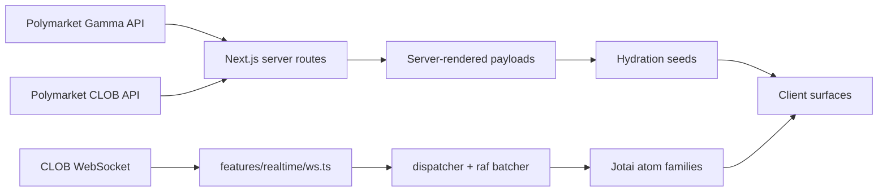

# Polymarket Clone

A high-fidelity Polymarket frontend clone built with `Next.js 16`, `React 19`, `TypeScript`, and `Jotai`.

This project is focused on reproducing what makes Polymarket feel like Polymarket: dense market discovery, strong shared chrome, realtime price movement, route parity across key surfaces, and a codebase that still feels deliberate under review.

## Goals

1. Match Polymarket's product feel as closely as possible.
2. Keep realtime market updates responsive and localized.
3. Ship recruiter-facing code quality, not just visual mimicry.

## Shipped Surfaces

- `/` home feed with hero spotlight, category chips, mixed market cards, and client feed expansion
- `/crypto` crypto market surface with family, asset, and time filters
- `/sports/live` live sports dashboard
- `/sports/futures` futures discovery surface
- `/sports/futures/[league]` league-specific futures dashboards
- `/sports/[league]/games` league game-market views
- `/sports/[league]/props` league props views
- `/event/[slug]` event detail route with live market rows

## What It Does

- Pulls live market and event data from Polymarket's public Gamma endpoints
- Hydrates live price updates from the public CLOB WebSocket
- Uses shared market-card primitives across home, crypto, sports, and event surfaces
- Keeps realtime updates scoped to token-level leaves with Jotai atom families
- Uses server-first route composition with focused client interactivity
- Includes loading states, route tests, parser tests, and realtime behavior coverage

## Architecture

The codebase is organized by product domain instead of page-local sprawl:

```text
app/                   App Router routes, route loading states, and thin API handlers
features/home/         Hero, chip feed, home card modeling, and feed rendering
features/market-cards/ Shared Polymarket-style card primitives
features/crypto/       Crypto parsing, filters, server payload assembly, and UI
features/sports/       Live, futures, games, props, and league surfaces
features/events/       Shared event feed infrastructure and event-card modeling
features/detail/       Event detail header, rows, and list rendering
features/realtime/     WebSocket client, hydration, batching, subscriptions, atoms
shared/                UI primitives, formatting, theme, and generic utilities
```

### Data Flow



## Realtime Strategy

Realtime behavior is a core part of the clone rather than an afterthought.

- Initial route payloads come from REST data on the server.
- Relevant token IDs are extracted into client hydration seeds.
- A shared WebSocket client subscribes only to the token IDs the rendered UI needs.
- Incoming messages are normalized and batched through `requestAnimationFrame`.
- Token-scoped Jotai atoms update the smallest UI leaves possible.

That keeps cards, odds cells, and market rows feeling live without broad rerenders across the page.

## Quality Snapshot

Current repo snapshot:

- `250` source files under `app/`, `features/`, and `shared/`
- `51` test files
- `205` individual tests
- `Next.js 16.2.4`
- `React 19.2.4`

## Running Locally

```bash
pnpm install
pnpm dev
```

Open [http://localhost:3000](http://localhost:3000).

Production-like run:

```bash
pnpm build
pnpm start
```

## Scripts

```bash
pnpm dev
pnpm build
pnpm start
pnpm lint
pnpm test
pnpm exec vitest run
```

## External Dependencies

This project currently relies on public Polymarket endpoints and does not require local secrets.

- Gamma API for market and event payloads
- CLOB API for market history
- CLOB WebSocket for live price updates

## Intentional Scope Limits

This clone is intentionally focused on read-only market discovery and realtime display.

- No trading flow or order entry
- No wallet connection or authentication
- No positions, comments, or holder views
- No attempt to fully mirror every Polymarket route or tab on the live site

## Why This Repo Exists

This is a greenfield clone built to show product taste and engineering discipline together:

- UI fidelity work instead of generic dashboard styling
- clear feature boundaries instead of flat route files
- live data integration instead of static mock screens
- meaningful tests around parsing, routing, and realtime behavior
